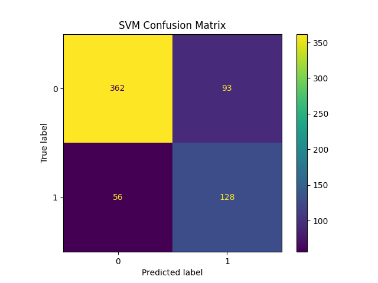
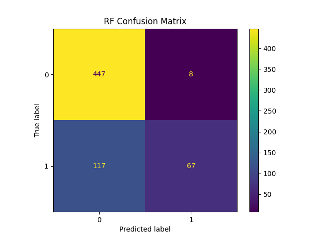
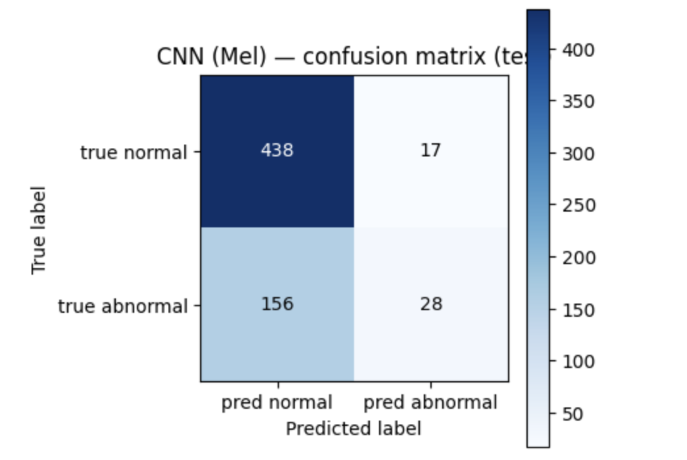

# MIMII Acoustic Anomaly Detection

Baseline acoustic anomaly detection experiments on the MIMII industrial machine dataset using classical machine learning and deep learning methods.

---

## Overview

This project investigates industrial machine anomaly detection using acoustic signals from the MIMII dataset.

The experiments compare:

- MFCC + Support Vector Machine (SVM)
- MFCC + Random Forest (RF)
- Mel-Spectrogram + CNN

Machine types evaluated:
- Fan
- Pump
- Valve
- Slider

This work is part of my MSc research on industrial AI and machine condition monitoring.

---

## Methods

### Classical Machine Learning
- MFCC feature extraction
- Feature normalization
- SVM classifier
- Random Forest classifier

### Deep Learning
- Mel-spectrogram generation
- CNN-based classification

---

## Evaluation Metrics

- Accuracy
- Precision
- Recall
- F1-score
- Confusion Matrix

---

## Example Results

### SVM Confusion Matrix



---

### Random Forest Confusion Matrix



---

### CNN Confusion Matrix



---

## Technologies

- Python
- Scikit-learn
- TensorFlow / Keras
- Librosa
- NumPy
- Matplotlib

---

## Repository Structure

```text
MIMII_MFCC_Fan_Baseline.ipynb
MIMII_CNN_Mel_Fan_Baseline.ipynb
Fan_svm_cm.png
Fan_rf_cm.png
Fan_cnn_cm.png
```

---

## Author

Amirreza Beig

LinkedIn:
https://linkedin.com/in/amirreza-beig
